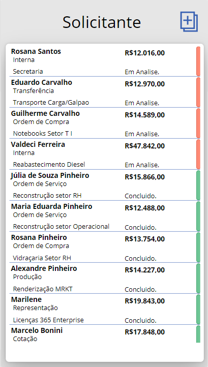
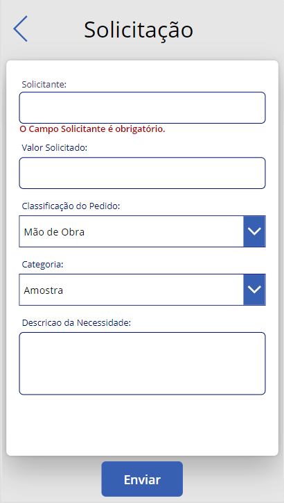
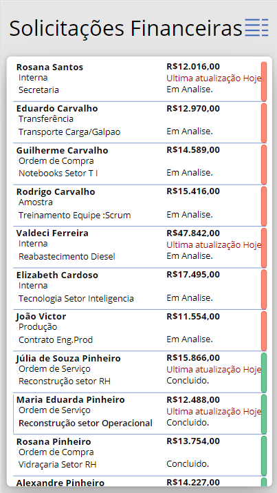
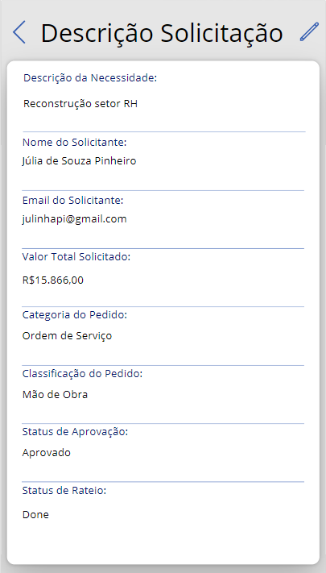
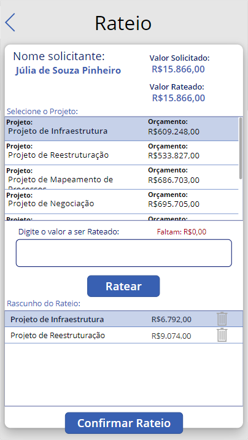
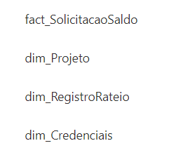

# PowerApps - Gerenciamento da Reserva Financeira


Vocês já pararam para pensar no problema de cometer erros no campo financeiro?💰
Certamente, um erro financeiro no mundo empresarial pode ser verdadeiramente catastrófico. Erros financeiros podem abalar a estabilidade de uma empresa e ter consequências a longo prazo, tais como:

<div display="block">
  <p>💔 • Perda de Confiança.</p>
  <p>📉 • Impacto nas Finanças.</p>
  <p>💸 • Dificuldades de Captação de Recursos.</p>
  <p>🚪 • Perda de Oportunidades.</p>
</div>
E diversas outras consequências...

✉️ Este Projeto aborda a importância da automação, e demonstra o Aplicativo de Gestão Financeira, destacando a necessidade de redução de erros e a conveniência de gerenciar as finanças empresariais em tempo real por meio de dispositivos móveis, utilizando o PowerApps.

O projeto deste aplicativo surgiu para lidar com a complexidade das finanças empresariais, onde diferentes partes desempenham papéis específicos, como o cargo responsável pelos fundos de investimento e a área operacional, realizando a distribuição desse dinheiro.

A automação simplifica o controle de recursos, o monitoramento de despesas e a gestão de orçamento, facilitando também a comunicação com os solicitantes. Isso agrega valor ao compromisso, priorizando a agilidade e mobilidade. Permite que a equipe financeira concentre-se no sucesso da empresa em um ambiente empresarial em constante evolução.

Afinal, alguns dos fatores-chave para o sucesso de uma equipe financeira incluem:

<div display="block">
  <p>⚙️- Automatização de Processos.</p>
  <p>📈- Gestão de Risco Financeiro.</p>
  <p>📢- Transparência e Comunicação Eficaz.</p>
  <p>💵- Otimização de Custos.</p>
</div>
<br/>
Sobre a utilização deste aplicativo, temos então as:

# Abas Solicitantes


<span></span>
<span></span>
<span></span>


A Primeira tela permite o Solicitante realizar uma nova solicitação, inspecionar e também editar ou excluir os pedidos já realizados.

Caso a parte interessada opte por um novo pedido, é então guiado a segunda tela, onde é disposto um formulário a ser preenchido com as informações e o valor a ser solicitado ao financeiro.

Após esse processo ser de fato finalizado, é guiado para a terceira tela, de acionamento e redirecionamento, avisando então ao Cliente que emails foram enviados para confirmação do pedido, e para a aprovação do Financeiro, realizando também o Redirecionamento para a tela principal do acesso Cliente ao App.

# Abas Financeiras
<span></span>
<span></span>
<span></span>


A Tela de inicio do Financeiro mostra todos os pedidos realizados, seus status de aprovação, status de rateio e abre a oportunidade par, inspecionar e também realizar o rateio caso necessario.

Caso a equipe financeira veja alguma ordem nova, é então levada a segunda tela, onde observam informações mais detalhadas sobre a solicitação e então tomam a decisão de rateio ou recusa.

Quando é dado inicio ao Rateio, temos então a terceira tela, de fato a tela para o gerenciamento das reservas, onde o operador financeiro define de qual reserva vai ser retirado o dinheiro para alimentar a solicitação feita, baseado na area, pedido e valor.

# Segurança

O Aplicativo conta com lógicas que trazem maior segurança a coleta e manutenção de dados.
Como as que proibem fraude e duplicidade de informações, lógicas que evitam exclusões de solicitações do usuário após o rateio, e mais uma sequência de atos que asseguram uma maior integridade nos dados.

Fórmula essa que faz a leitura do valor Rateado e do Valor Solicitado, garante que todos os parametros sejam atendidos para a realização do rateio:
```bald
If((Value(gal_Solicitacao_Financeiro.Selected.lbl_ValorTotalSolicitado.Text) - Value(gal_Solicitacao_Financeiro.Selected.valorRateado)) > 0 ;
    UpdateContext({ varRascunhoRateio : varRascunhoRateio + DataCardValue15 });;
    If(Value(gal_OrcamentoProjeto_Rateio.Selected.lbl_gal_ValorOrcamento.Text)>= varRascunhoRateio;
        If(Value(gal_Solicitacao_Financeiro.Selected.lbl_ValorTotalSolicitado.Text) - Value(gal_Solicitacao_Financeiro.Selected.valorRateado) >= varRascunhoRateio;
            SubmitForm(form_RegistroRateio);;
                Concurrent(
                        Patch(
                            dimProjeto;
                            LookUp(
                                dimProjeto;
                                idProjeto = gal_OrcamentoProjeto_Rateio.Selected.idProjeto
                            );
                            {orçamentoTotalProjeto: (gal_OrcamentoProjeto_Rateio.Selected.orçamentoTotalProjeto - varRascunhoRateio)}
                            );
                        Patch(
                            solicitacaoSaldo;
                            LookUp(
                                solicitacaoSaldo;
                                ID = gal_Solicitacao_Financeiro.Selected.ID
                            );
                            {valorRateado: ( gal_Solicitacao_Financeiro.Selected.valorRateado + varRascunhoRateio )}
                            )
                );;
            Notify("Rateio Realizado com Sucesso.";NotificationType.Success));
            Notify("O Solicitado é maior que o orçamento.";NotificationType.Error);

        If(Value(gal_Solicitacao_Financeiro.Selected.lbl_ValorTotalSolicitado.Text) - Value(gal_Solicitacao_Financeiro.Selected.valorRateado < varRascunhoRateio);
            Notify("Já destinaram o dinheiro necessário para essa Solicitação."; NotificationType.Error))
    );
    (Value(gal_Solicitacao_Financeiro.Selected.lbl_ValorTotalSolicitado.Text) - Value(gal_Solicitacao_Financeiro.Selected.valorRateado)) <= 0;
    Notify("A Solicitacao ja foi rateada."; NotificationType.Error));;
UpdateContext({ varRascunhoRateio : 0 })
```

E outro exemplo são formulas de backup, caso queira voltar a certo ponto do rateio.
```bald
Concurrent(
    Patch(
            dimProjeto;
            LookUp(
                dimProjeto;
                idProjeto = gal_OrcamentoProjeto_Rateio.Selected.idProjeto
            );
            {orçamentoTotalProjeto: (gal_OrcamentoProjeto_Rateio.Selected.orçamentoTotalProjeto + gal_RegistroRateio_Atual.Selected.valorRetirado)}
            );
        Patch(
            solicitacaoSaldo;
            LookUp(
                solicitacaoSaldo;
                ID = gal_Solicitacao_Financeiro.Selected.ID
            );
            {valorRateado: ( gal_Solicitacao_Financeiro.Selected.valorRateado - gal_RegistroRateio_Atual.Selected.valorRetirado)}
        );
Remove(dimRegistroRateio;gal_RegistroRateio_Atual.Selected);
UpdateContext({varConfirm:false})
)
```
Fórmulas como essas mantém a integridade dos Dados e facilita o trabalho futuro.

# Banco de Dados

O "Banco de Dados" utilizado nesse projeto foi o Microsoft Sharepoint. 

Sim, sabemos que o SharePoint não é BD, mas nesse caso as listas funcionariam melhor para a criação do aplicativo, visto que o projeto seria implementado no Ambiente da empresa destino.

Contamos então com 4 Listas para este projeto.

<span></span>

onde: 

fact_SolicitaçãoSaldo = Lista "Fato", onde ficam armazenadas todas as informações sobre as solicitações, desde quem fez, quem atualizou, datas, valores, e descrições. Por se tratar de uma tabela Fato, é onde todas as informações se reunem.

dim_Projeto = Lista dos Projetos, orçamento inicial e atual de cada um deles.

dim_RegistroRateio = Lista que trata dos dados em rateio ou já rateados.

dim_Credenciais = Lista que armazena as informações para o Login, pois o app conta com uma tela extra de login/redirecionamento interno para a empresa.


# Conclusão

Após a finalização desse projeto, pude ver com falicidade a capacidade da ferramenta Power Apps e também tive um leve gostinho do que o Power Automate pode fazer, e com convicção posso dizer que essas ferramentas da Power Plaform são incriveis, faceis de lidar e de transformar uma tarefa em resultado.

Estarei postando também o resumo do mesmo projeto, mas com finalidades para Analise de dados e tomada de decisão da Diretoria com base nas listas criadas e populadas através do aplicativo.

Nos vemos por aqui em um próximo projeto!


